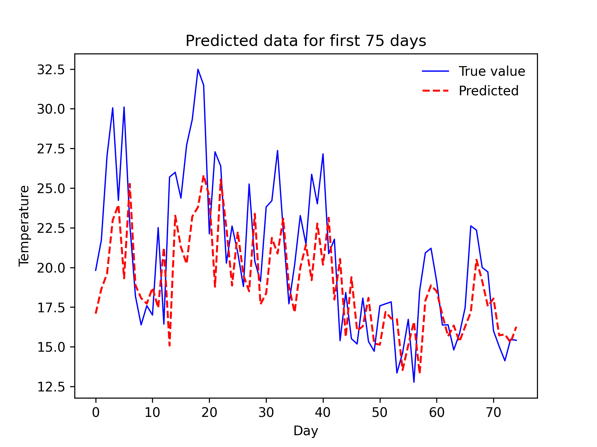
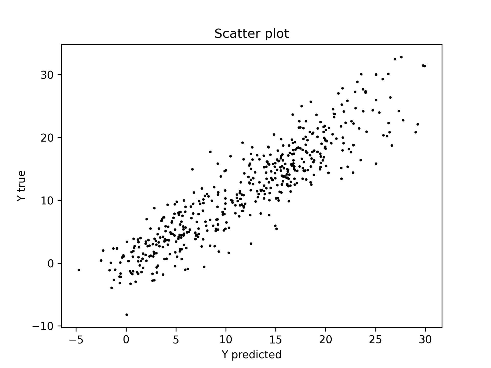
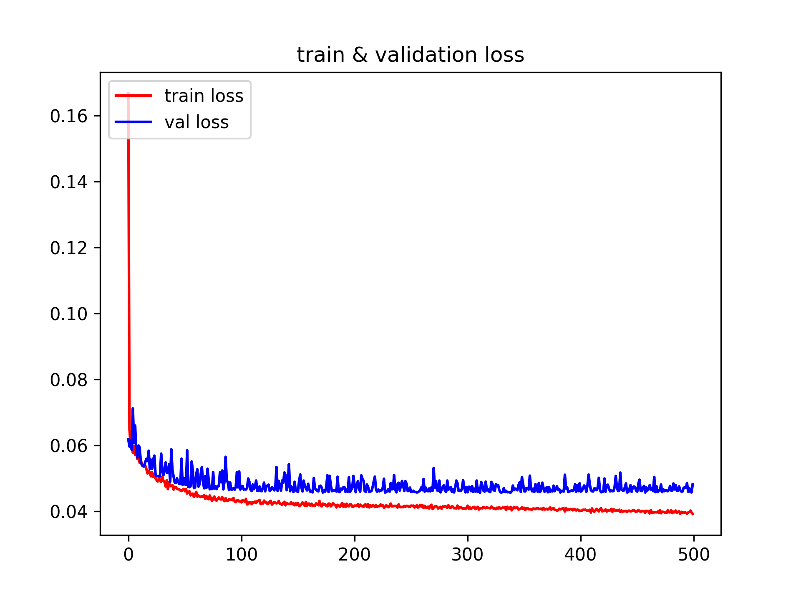
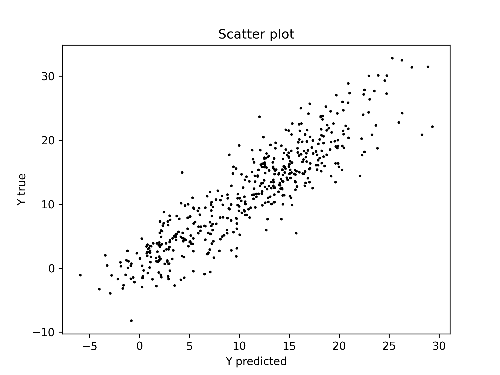
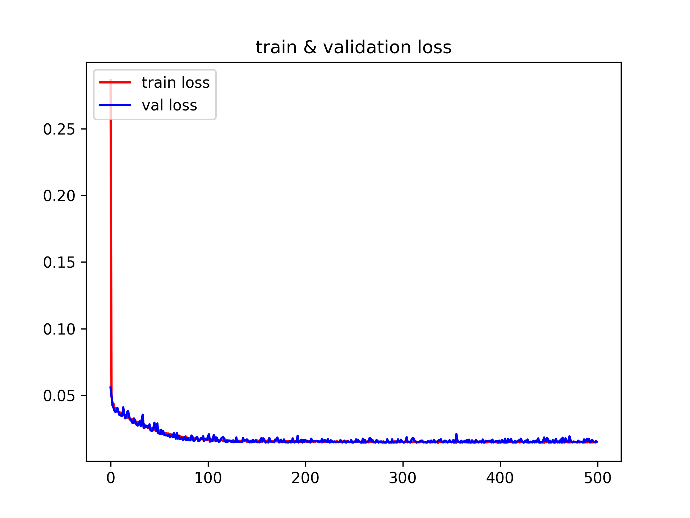
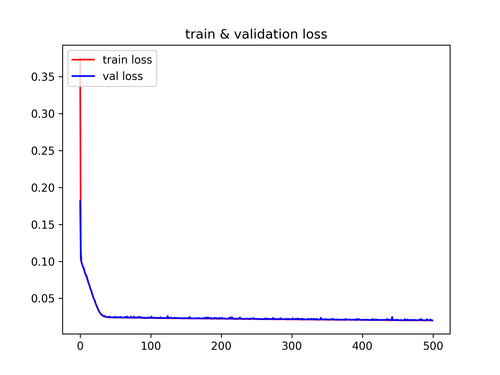
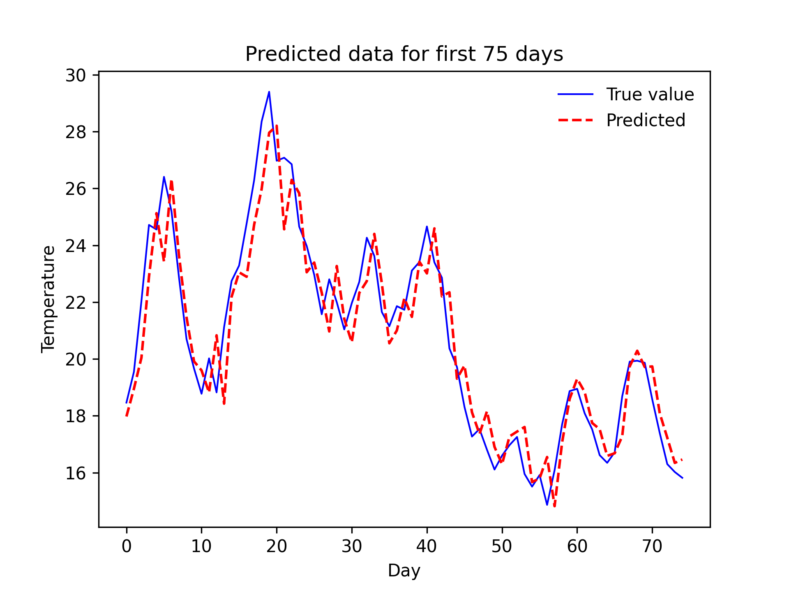

# Comparison efficency of SimpleRNN, LSTM and GRU in processing of sequences

## Development Environment
* CPU: Intel(R) Core(TM) i5-7600K CPU @ 380GHz 3.79 GHz
* Ram: 16.0 GB 
* Python: 3.9.10
* Keras: 2.10.0
* NumPy: 1.22.1
* SciPy: 1.7.3
* Scikit-learn: 1.0.2
* Pandas: 1.4.0
* Matplotlib: 3.5.1
* TensorFlow: 2.10.0

<!-- dataset -->
## Dataset


<!-- foders structure -->
## Folders structure
```
└── results 
    ├── specifications_1
    │   ├── model_1
    │   │   ├── charts
    │   │   │   ├── AllData.png
    │   │   │   ├── PredictedData.png
    │   │   │   ├── PredictedDataForFirst75Days.png
    │   │   │   ├── ResidualPlot.png
    │   │   │   ├── ScatterPlot.png
    │   │   │   ├── Train&ValidationLoss.png
    │   │   │   └── TrainingCurve.png
    │   │   ├── history
    │   │   │   └── history.csv
    │   │   └── weights
    │   │       └── weights.HDF5
    │   │
    │   ├── model_2
    │   ├── ...
    │   ├── ...
    │   ├── time.csv
    │   └── averageDistance.csv
    │
    ├── specifications_2
    │   ├── ...
    │   └── ...
    ├── ...
    └── ...
```

<!-- models -->
## Models
|Optimizers|SimpleRNN            | LSTM           |GRU            |
|:--------:|:-------------------:|:--------------:|:-------------:|
|          |SimpleRNN(None,32)   | LSTM(None,32)  |GRU(None,32)   |
|          |Dense(None,1)        | Dense(None,1)  |Dense(None,1)  |
|          |─────────────────────|────────────────|───────────────|
|          |SimpleRNN(None,10,32)|LSTM(None,10,32)|GRU(None,10,32)|
|          |SimpleRNN(None,10,32)|LSTM(None,10,32)|GRU(None,10,32)|
|          |SimpleRNN(None,32)   |LSTM(None,32)   |GRU(None,32)   |
|          |Dense(None,1)        |Dense(None,1)   |Dense(None,1)  |
|          |─────────────────────|────────────────|───────────────|
| RMSprop  |SimpleRNN(None,10,64)|LSTM(None,10,64)|GRU(None,10,64)|
|          |SimpleRNN(None,10,32)|LSTM(None,10,32)|GRU(None,10,32)|
|          |SimpleRNN(None,16)   |LSTM(None,16)   |GRU(None,16)   |
|          |Dense(None,1)        |Dense(None,1)   |Dense(None,1)  |
|          |─────────────────────|────────────────|───────────────|
|          |SimpleRNN(None,10,64)|LSTM(None,10,64)|GRU(None,10,64)|
|          |SimpleRNN(None,10,32)|LSTM(None,10,32)|GRU(None,10,32)|
|          |SimpleRNN(None,16)   |LSTM(None,16)   |GRU(None,16)   |
|          |Dense(None,1)        |Dense(None,1)   |Dense(None,1)  |
|──────────|─────────────────────|────────────────|───────────────|
|          |SimpleRNN(None,32)   |LSTM(None,32)   |GRU(None,32)   |
|          |Dense(None,1)        |Dense(None,1)   |Dense(None,1)  |
|          |─────────────────────|────────────────|───────────────|
|          |SimpleRNN(None,10,32)|LSTM(None,10,32)|GRU(None,10,32)|
|          |SimpleRNN(None,10,32)|LSTM(None,10,32)|GRU(None,10,32)|
|          |SimpleRNN(None,32)   |LSTM(None,32)   |GRU(None,32)   |
|          |Dense(None,1)        |Dense(None,1)   |Dense(None,1)  |
|          |─────────────────────|────────────────|───────────────|
| SGD      |SimpleRNN(None,10,64)|LSTM(None,10,64)|GRU(None,10,64)|
|          |SimpleRNN(None,10,32)|LSTM(None,10,32)|GRU(None,10,32)|
|          |SimpleRNN(None,16)   |LSTM(None,16)   |GRU(None,16)   |
|          |Dense(None,1)        |Dense(None,1)   |Dense(None,1)  |
|          |─────────────────────|────────────────|───────────────|
|          |SimpleRNN(None,10,64)|LSTM(None,10,64)|GRU(None,10,64)|
|          |SimpleRNN(None,10,32)|LSTM(None,10,32)|GRU(None,10,32)|
|          |SimpleRNN(None,16)   |LSTM(None,16)   |GRU(None,16)   |
|          |Dense(None,1)        |Dense(None,1)   |Dense(None,1)  |

<!-- ├ ┬ ┼  ┤ -->

<!-- Results for t -->
### Results for T
### Average distance for T
<table align="center">
<tr align='center'>
    <td>units_optimizer</td> <td>model</td> <td>averageDistance [degC]</td> 
</tr>

<tr align='center'>
    <td>32_RMSprop</td> <td>simplernn1_32_RMSprop <br>lstm1_32_RMSprop <br>gru1_32_RMSprop</td> <td>2,6451 <br>2,6347 <br>2,6332</td> 
</tr>

<tr align='center'>
    <td>32_SGD</td> <td>simplernn1_32_SGD <br>lstm1_32_SGD <br>gru1_32_SGD</td> <td>2,6183 <br>2,8037 <br>2,6208</td> 
</tr>

<tr align='center'>
    <td>32_32_32_RMSprop <td>simplernn3_32_32_32_RMSprop <br>lstm3_32_32_32_RMSprop <br>gru3_32_32_32_RMSprop <td>2,8660<br>2,7292<br>2,7452
</tr>

<tr align='center'>
    <td>32_32_32_SGD <td>simplernn3_32_32_32_SGD <br>lstm3_32_32_32_SGD <br>gru3_32_32_32_SGD <td>2,6651 <br>3,4455 <br>2,9858
</tr>


<tr align='center'>
    <td>16_32_64_RMSprop <td>simplernn3_16_32_64_RMSprop <br>lstm3_16_32_64_RMSprop <br>gru3_16_32_64_RMSprop <td>2,7898 <br>2,7823 <br>2,7250
</tr>

<tr align='center'>
    <td>16_32_64_SGD <td>simplernn3_16_32_64_SGD <br>lstm3_16_32_64_SGD <br>gru3_16_32_64_SGD <td>2,7576 <br>3,4385 <br>3,0342
</tr>


<tr align='center'>
    <td>64_32_16_RMSprop <td>simplernn3_64_32_16_RMSprop <br>lstm3_64_32_16_RMSprop <br>gru3_64_32_16_RMSprop <td>3,0799 <br>2,7002 <br>2,7347
</tr>

<tr align='center'>
    <td>64_32_16_SGD <td>simplernn3_64_32_16_SGD <br>lstm3_64_32_16_SGD <br>gru3_64_32_16_SGD  <td>2,8408 <br>3,4264 <br>2,9946
</tr>
</table>

<!-- |          |model                      |averageDistance degC|
|:--------:|:-------------------------:|:------------------:|
|32        |simplernn1_32_RMSprop      |2.6451327808128315  |
|RMSprop   |`lstm1_32_RMSprop`         |`2.634731841976658` |
|          |gru1_32_RMSprop            |2.6331591564837304  |
|──────────|───────────────────────────|────────────────────|
|32        |`simplernn1_32_SGD`        |`2.618292828682733` |
|SGD       |lstm1_32_SGD               |2.8037038837881125  |
|          |`gru1_32_SGD`              |`2.62076415815729`  |
|──────────|───────────────────────────|────────────────────|
|32_32_32  |simplernn3_32_32_32_RMSprop|2.865973051694582   |
|RMSprop   |lstm3_32_32_32_RMSprop     |2.729212822038299   |
|          |gru3_32_32_32_RMSprop      |2.745191264720594   |
|──────────|───────────────────────────|────────────────────|
|32_32_32  |simplernn3_32_32_32_SGD    |2.6650527978019385  |
|SGD       |lstm3_32_32_32_SGD         |3.445523014778766   |
|          |gru3_32_32_32_SGD          |2.9858316431687197  |
|──────────|───────────────────────────|────────────────────|
|16_32_64  |simplernn3_16_32_64_RMSprop|2.7898178471202146  |
|RMSprop   |lstm3_16_32_64_RMSprop     |2.782277435279318   |
|          |gru3_16_32_64_RMSprop      |2.7250013006201805  |
|──────────|───────────────────────────|────────────────────|
|16_32_64  |simplernn3_16_32_64_SGD    |2.75758577485546    |
|SGD       |lstm3_16_32_64_SGD         |3.4385166828121463  |
|          |gru3_16_32_64_SGD          |3.0341526444499607  |
|──────────|───────────────────────────|────────────────────|
|64_32_16  |simplernn3_64_32_16_RMSprop|3.079921303027137   |
|RMSprop   |lstm3_64_32_16_RMSprop     |2.700237106817222   |
|          |gru3_64_32_16_RMSprop      |2.7347319761429514  |
|──────────|───────────────────────────|────────────────────|
|64_32_16  |simplernn3_64_32_16_SGD    |2.840829965699388   |
|SGD       |lstm3_64_32_16_SGD         |3.4263785342488977  |
|          |gru3_64_32_16_SGD          |2.994584340730189   | -->


### Train & Validation Loss
<table align="center">
<tr align='center'>
<th> simplernn1_32_SGD </th>
<th> lstm1_32_RMSprop </th>
<th> gru1_32_SGD </th>
</tr>
<tr>
<td>

<td>

<td>
</tr>
</table>


### Predicted Data For First 75 Days
<table align="center">
<tr align='center'>
<th> simplernn1_32_SGD </th>
<th> lstm1_32_RMSprop </th>
<th> gru1_32_SGD </th>
</tr>
<tr>
<td>

<td>

<td>
</tr>
</table>


### Scatter Plots
<table align="center">
<tr align='center'>
<th> simplernn1_32_SGD </th>
<th> lstm1_32_RMSprop </th>
<th> gru1_32_SGD </th>
</tr>
<tr>
<td>

<td>

<td>
</tr>
</table>


### Prediction Mistake
<table align="center">
<tr align='center'>
<th> simplernn1_32_SGD </th>
<th> lstm1_32_RMSprop </th>
<th> gru1_32_SGD </th>
</tr>
<tr>
<td>

<td>

<td>
</tr>
</table>

<!-- Results for T_p_H2OC_maxWv -->
## Results for T_p_H2OC_maxWv
<table align="center">
<tr align='center'>
    <td>units_optimizer</td> <td>model</td> <td>averageDistance [degC]</td> 
</tr>

<tr align="center">
    <td> 32_RMSprop <td> simplernn1_32_RMSprop <br>lstm1_32_RMSprop <br>gru1_32_RMSprop <td>2,8371 <br>2,9501 <br>2,8693
</tr>

<tr align="center">
    <td>32_SGD <td>simplernn1_32_SGD <br>lstm1_32_SGD <br>gru1_32_SGD <td>3,0006 <br>3,0140 <br>2,6824
</tr>

<tr align="center">
    <td>32_32_32_RMSprop <td>simplernn3_32_32_32_RMSprop <br>lstm3_32_32_32_RMSprop <br>gru3_32_32_32_RMSprop <td>4,0512 <br>3,0534 <br>3,4401
</tr>

<tr align="center">
    <td>32_32_32_SGD <td>simplernn3_32_32_32_SGD <br>lstm3_32_32_32_SGD <br>gru3_32_32_32_SGD <td>3,3595 <br>3,8607 <br>3,1698
</tr>

<tr align="center">
    <td>16_32_64_RMSprop <td>simplernn3_16_32_64_RMSprop <br>lstm3_16_32_64_RMSprop <br>gru3_16_32_64_RMSprop <td>3,6657 <br>3,3600 <br>3,4465
</tr>

<tr align="center">
    <td>16_32_64_SGD <td>simplernn3_16_32_64_SGD <br>lstm3_16_32_64_RMSprop <br>gru3_16_32_64_RMSprop <td>3,0533 <br>4,0238 <br>3,1776
</tr>

<tr align="center">
    <td>64_32_16_RMSprop <td>simplernn3_64_32_16_RMSprop <br>lstm3_64_32_16_RMSprop <br>gru3_64_32_16_RMSprop <td>4,0028 <br>3,6192 <br>3,8740
</tr>

<tr align="center">
    <td>64_32_16_SGD <td>simplernn3_64_32_16_SGD <br>lstm3_64_32_16_SGD <br>gru3_64_32_16_SGD <td>3,2403 <br>3,7618 <br>2,9983
</tr>
</table>

<!-- <tr>
    <td> <td> <br> <br> <td> <br> <br>
</tr> -->

### Train & Validation Loss
<table align="center">
<tr align='center'>
<th> simplernn1_32_RMSprop </th>
<th> lstm1_32_RMSprop </th>
<th> gru1_32_SGD </th>
</tr>
<tr>
<td>

<td>

<td>
</tr>
</table>


### Predicted Data For First 75 Days
<table align="center">
<tr align='center'>
<th> simplernn1_32_RMSprop </th>
<th> lstm1_32_RMSprop </th>
<th> gru1_32_SGD </th>
</tr>
<tr>
<td>

<td>

<td>
</tr>
</table>


### Scatter Plots
<table align="center">
<tr align='center'>
<th> simplernn1_32_RMSprop </th>
<th> lstm1_32_RMSprop </th>
<th> gru1_32_SGD </th>
</tr>
<tr>
<td>

<td>

<td>
</tr>
</table>


### Prediction Mistake
<table align="center">
<tr align='center'>
<th> simplernn1_32_RMSprop </th>
<th> lstm1_32_RMSprop </th>
<th> gru1_32_SGD </th>
</tr>
<tr>
<td>

<td>

<td>
</tr>
</table>


## EMA_data for T
<table align="center">
<tr align='center'>
    <th> EMA temperature </th>
</tr>
<tr>
    <td>
</tr>
</table>


### Train & Validation Loss
<table align="center">
<tr align='center'>
<th> simplernn1_32_SGD </th>
<th> lstm1_32_RMSprop </th>
<th> gru1_32_SGD </th>
</tr>
<tr>
<td>

<td>

<td>
</tr>
</table>


### Predicted Data For First 75 Days
<table align="center">
<tr align='center'>
<th> simplernn1_32_SGD </th>
<th> lstm1_32_RMSprop </th>
<th> gru1_32_SGD </th>
</tr>
<tr>
<td>

<td>

<td>
</tr>
</table>


### Scatter Plots
<table align="center">
<tr align='center'>
<th> simplernn1_32_SGD </th>
<th> lstm1_32_RMSprop </th>
<th> gru1_32_SGD </th>
</tr>
<tr>
<td>

<td>

<td>
</tr>
</table>


### Prediction Mistake
<table align="center">
<tr align='center'>
<th> simplernn1_32_SGD </th>
<th> lstm1_32_RMSprop </th>
<th> gru1_32_SGD </th>
</tr>
<tr>
<td>

<td>

<td>
</tr>
</table>
