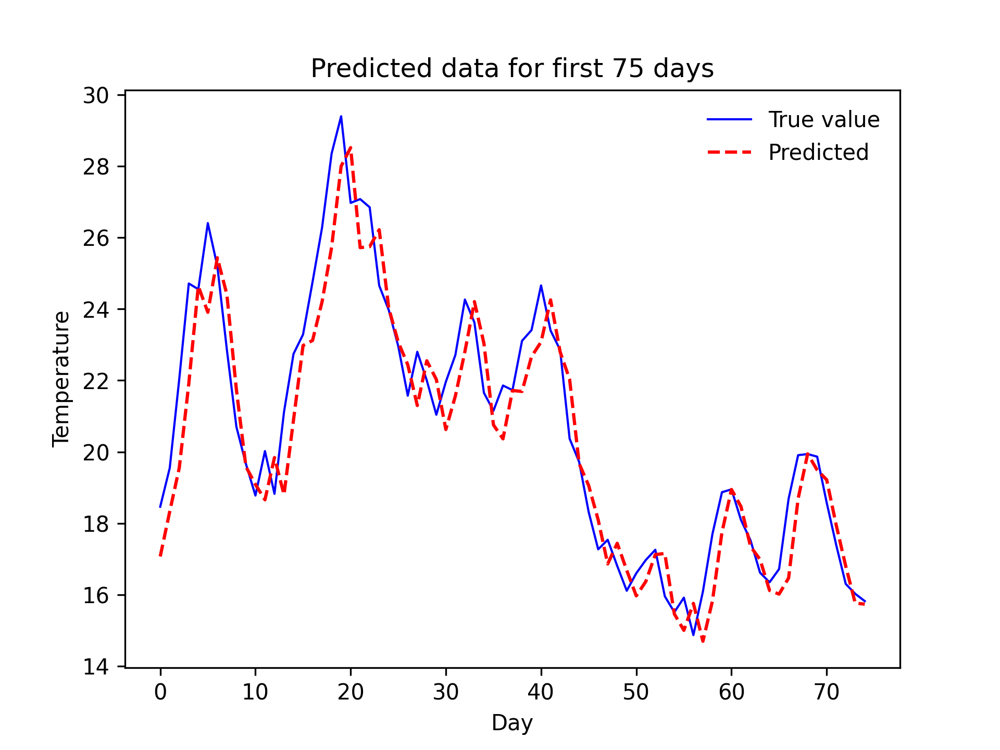
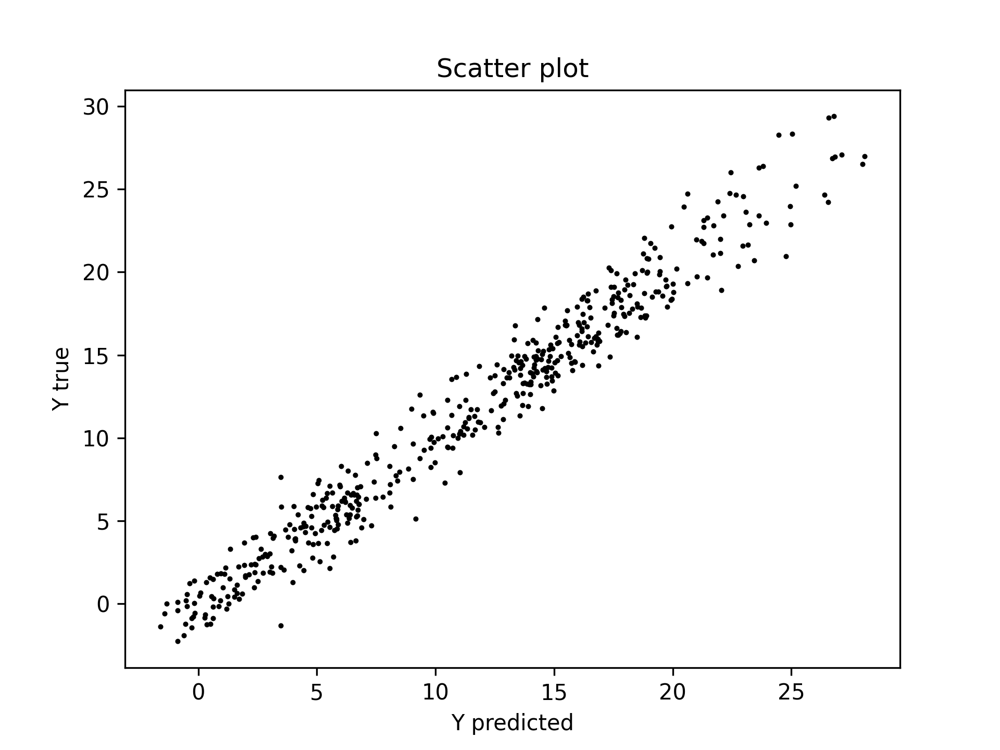

# Comparison efficency of SimpleRNN, LSTM and GRU in processing of sequences
<!-- ├ ┬ ┼  ┤ -->
## Introduction
The research consisted of comparing the effectiveness of models built based on SimpleRNN, LSTM and GRU layers in sequence processing. The research included teaching and testing of the developed models. The task of the models was to predict the prevailing temperature after 24 hours based on the previous 10 days.

The research was conducted in three ways
* for data containing only temperature (T)
* for data containing temperature, pressure, humidity and maximum wind speed (T_p_H2OC_maxWv)
* for data containing temperature modified by an exponential moving average of the last two days (EMA_T)

The effectiveness of the model was evaluated by the model learning time and the average distance between the prediction and the expected value, described by the formula:
<!-- $\aD=(sum(|X x_true - X x_pred|))/n$ -->
$$ x = {sum  (|a-b|)}/n $$


Edit the **`config.py`** file to select training parameters by changing the values, commenting or uncommenting the code with true/false values.
To run training and prediction run **`main.py`**:


## Development Environment
* CPU: Intel(R) Core(TM) i5-7600K CPU @ 380GHz 3.79 GHz
* Ram: 16.0 GB 
* Python: 3.9.10
* Keras: 2.10.0
* NumPy: 1.22.1
* SciPy: 1.7.3
* Scikit-learn: 1.0.2
* Pandas: 1.4.0
* Matplotlib: 3.5.1
* TensorFlow: 2.10.0

<!-- dataset -->
## Dataset


## Training and predict schema


<!-- foders structure -->
## Folders structure
```
└── results 
    ├── specifications_1
    │   ├── model_1
    │   │   ├── charts
    │   │   │   ├── AllData.png
    │   │   │   ├── PredictedData.png
    │   │   │   ├── PredictedDataForFirst75Days.png
    │   │   │   ├── ResidualPlot.png
    │   │   │   ├── ScatterPlot.png
    │   │   │   ├── Train&ValidationLoss.png
    │   │   │   └── TrainingCurve.png
    │   │   ├── history
    │   │   │   └── history.csv
    │   │   └── weights
    │   │       └── weights.HDF5
    │   │
    │   ├── model_2
    │   ├── ...
    │   ├── ...
    │   ├── time.csv
    │   └── averageDistance.csv
    │
    ├── specifications_2
    │   ├── ...
    │   └── ...
    ├── ...
    └── ...
```

<!-- models -->
## Models summary
<table align="center">
<tr align='center'>
    <td>Optimizers <td>SimpleRNN <td>LSTM <td>GRU
</tr>

<tr align='center'>
    <td>RMSprop <td>SimpleRNN(None,32) <br>Dense(None,1) <td>LSTM(None,32) <br>Dense(None,1) <td>GRU(None,32) <br>Dense(None,1)
</tr>

<tr align='center'>
    <td>RMSprop <td>SimpleRNN(None,10,32) <br>SimpleRNN(None,10,32) <br>SimpleRNN(None,32) <br>Dense(None,1) <td>LSTM(None,10,32) <br>LSTM(None,10,32) <br>LSTM(None,32) <br>Dense(None,1) <td>GRU(None,10,32) <br>GRU(None,10,32) <br>GRU(None,32) <br>Dense(None,1)
</tr>

<tr align='center'>
    <td>RMSprop <td>SimpleRNN(None,10,64) <br>SimpleRNN(None,10,32) <br>SimpleRNN(None,16) <br>Dense(None,1) <td>LSTM(None,10,64) <br>LSTM(None,10,32) <br>LSTM(None,16) <br>Dense(None,1) <td>GRU(None,10,64) <br>GRU(None,10,32) <br>GRU(None,16) <br>Dense(None,1)
</tr>

<tr align='center'>
    <td>RMSprop <td>SimpleRNN(None,10,16) <br>SimpleRNN(None,10,32) <br>SimpleRNN(None,64) <br>Dense(None,1) <td>LSTM(None,10,16) <br>LSTM(None,10,32) <br>LSTM(None,64) <br>Dense(None,1) <td>GRU(None,10,16) <br>GRU(None,10,32) <br>GRU(None,64) <br>Dense(None,1)
</tr>


<tr align='center'>
    <td>SGD <td>SimpleRNN(None,32) <br>Dense(None,1) <td>LSTM(None,32) <br>Dense(None,1) <td>GRU(None,32) <br>Dense(None,1)
</tr>

<tr align='center'>
    <td>SGD <td>SimpleRNN(None,10,32) <br>SimpleRNN(None,10,32) <br>SimpleRNN(None,32) <br>Dense(None,1) <td>LSTM(None,10,32) <br>LSTM(None,10,32) <br>LSTM(None,32) <br>Dense(None,1) <td>GRU(None,10,32) <br>GRU(None,10,32) <br>GRU(None,32) <br>Dense(None,1)
</tr>

<tr align='center'>
    <td>SGD <td>SimpleRNN(None,10,64) <br>SimpleRNN(None,10,32) <br>SimpleRNN(None,16) <br>Dense(None,1) <td>LSTM(None,10,64) <br>LSTM(None,10,32) <br>LSTM(None,16) <br>Dense(None,1) <td>GRU(None,10,64) <br>GRU(None,10,32) <br>GRU(None,16) <br>Dense(None,1)
</tr>

<tr align='center'>
    <td>SGD <td>SimpleRNN(None,10,16) <br>SimpleRNN(None,10,32) <br>SimpleRNN(None,64) <br>Dense(None,1) <td>LSTM(None,10,16) <br>LSTM(None,10,32) <br>LSTM(None,64) <br>Dense(None,1) <td>GRU(None,10,16) <br>GRU(None,10,32) <br>GRU(None,64) <br>Dense(None,1)
</tr>
</table>


<!-- Results for t -->
## Results (T)
<table align="center">
<tr align='center'>
    <td>model <td>averageDistance [degC] <td> learning time [sec]
</tr>

<tr align='center'>
    <td>simplernn1_32_RMSprop <br>lstm1_32_RMSprop <br>gru1_32_RMSprop <td>2,6451 <br>2,6347 <br>2,6332 <td>29,01 <br>52,54 <br>47,76
</tr>

<tr align='center'>
    <td>simplernn1_32_SGD <br>lstm1_32_SGD <br>gru1_32_SGD</td> <td>2,6183 <br>2,8037 <br>2,6208 <td>33,47 <br>48,52 <br>52,96
</tr>

<tr align='center'>
    <td>simplernn3_32_32_32_RMSprop <br>lstm3_32_32_32_RMSprop <br>gru3_32_32_32_RMSprop <td>2,8660<br>2,7292<br>2,7452 <td>49,62 <br>98,86 <br>92,05
</tr>

<tr align='center'>
    <td>simplernn3_32_32_32_SGD <br>lstm3_32_32_32_SGD <br>gru3_32_32_32_SGD <td>2,6651 <br>3,4455 <br>2,9858 <td>45,74 <br>
107,08 <br>117,61
</tr>

<tr align='center'>
    <td>simplernn3_16_32_64_RMSprop <br>lstm3_16_32_64_RMSprop <br>gru3_16_32_64_RMSprop <td>2,7898 <br>2,7823 <br>2,7250 <td>54,46 <br>118,95 <br>153,51
</tr>

<tr align='center'>
    <td>simplernn3_16_32_64_SGD <br>lstm3_16_32_64_SGD <br>gru3_16_32_64_SGD <td>2,7576 <br>3,4385 <br>3,0342 <td>72,7 <br>146,38 <br>181,25
</tr>

<tr align='center'>
    <td>simplernn3_64_32_16_RMSprop <br>lstm3_64_32_16_RMSprop <br>gru3_64_32_16_RMSprop <td>3,0799 <br>2,7002 <br>2,7347 <td>66,25 <br>149,87 <br>134,57
</tr>

<tr align='center'>
    <td>simplernn3_64_32_16_SGD <br>lstm3_64_32_16_SGD <br>gru3_64_32_16_SGD  <td>2,8408 <br>3,4264 <br>2,9946 <td>76,02 <br>161,52 <br>131,22
</tr>
</table>


### Train & Validation Loss (T)
<table align="center">
<tr align='center'>
<th> simplernn1_32_SGD </th>
<th> lstm1_32_RMSprop </th>
<th> gru1_32_SGD </th>
</tr>
<tr>
<td>

<td>

<td>
</tr>
</table>


### Predicted Data For First 75 Days (T)
<table align="center">
<tr align='center'>
<th> simplernn1_32_SGD </th>
<th> lstm1_32_RMSprop </th>
<th> gru1_32_SGD </th>
</tr>
<tr>
<td>

<td>

<td>
</tr>
</table>


### Scatter Plots (T)
<table align="center">
<tr align='center'>
<th> simplernn1_32_SGD </th>
<th> lstm1_32_RMSprop </th>
<th> gru1_32_SGD </th>
</tr>
<tr>
<td>

<td>

<td>
</tr>
</table>


### Prediction Mistake (T)
<table align="center">
<tr align='center'>
<th> simplernn1_32_SGD </th>
<th> lstm1_32_RMSprop </th>
<th> gru1_32_SGD </th>
</tr>
<tr>
<td>

<td>

<td>
</tr>
</table>

<!-- Results for T_p_H2OC_maxWv -->
## Results (T_p_H2OC_maxWv)
<table align="center">
<tr align='center'>
    <td>model <td>averageDistance [degC] <td> learning time [sec]
</tr>

<tr align="center">
    <td> simplernn1_32_RMSprop <br>lstm1_32_RMSprop <br>gru1_32_RMSprop <td>2,8371 <br>2,9501 <br>2,8693 <td>33,4 <br>48,91 <br>47,09
</tr>

<tr align="center">
    <td>simplernn1_32_SGD <br>lstm1_32_SGD <br>gru1_32_SGD <td>3,0006 <br>3,0140 <br>2,6824 <td>30,73 <br>47,27 <br>48,9
</tr>

<tr align="center">
    <td>simplernn3_32_32_32_RMSprop <br>lstm3_32_32_32_RMSprop <br>gru3_32_32_32_RMSprop <td>4,0512 <br>3,0534 <br>3,4401 <td>50,52 <br>90,14 <br>92,9
</tr>

<tr align="center">
    <td>simplernn3_32_32_32_SGD <br>lstm3_32_32_32_SGD <br>gru3_32_32_32_SGD <td>3,3595 <br>3,8607 <br>3,1698 <td>47,05 <br>95,89 <br>93,53
</tr>

<tr align="center">
    <td>simplernn3_16_32_64_RMSprop <br>lstm3_16_32_64_RMSprop <br>gru3_16_32_64_RMSprop <td>3,6657 <br>3,3600 <br>3,4465 <td>50,32 <br>121,15 <br>118,43
</tr>

<tr align="center">
    <td>simplernn3_16_32_64_SGD <br>lstm3_16_32_64_RMSprop <br>gru3_16_32_64_RMSprop <td>3,0533 <br>4,0238 <br>3,1776 <td>44,01 <br>141,15 <br>133,71
</tr>

<tr align="center">
    <td>simplernn3_64_32_16_RMSprop <br>lstm3_64_32_16_RMSprop <br>gru3_64_32_16_RMSprop <td>4,0028 <br>3,6192 <br>3,8740 <td>63,51 <br>140,39 <br>126,2
</tr>

<tr align="center">
    <td>simplernn3_64_32_16_SGD <br>lstm3_64_32_16_SGD <br>gru3_64_32_16_SGD <td>3,2403 <br>3,7618 <br>2,9983 <td>48,68 <br>138,38 <br>131,59
</tr>
</table>


### Train & Validation Loss (T_p_H2OC_maxWv)
<table align="center">
<tr align='center'>
<th> simplernn1_32_RMSprop </th>
<th> lstm1_32_RMSprop </th>
<th> gru1_32_SGD </th>
</tr>
<tr>
<td>

<td>

<td>
</tr>
</table>


### Predicted Data For First 75 Days (T_p_H2OC_maxWv)
<table align="center">
<tr align='center'>
<th> simplernn1_32_RMSprop </th>
<th> lstm1_32_RMSprop </th>
<th> gru1_32_SGD </th>
</tr>
<tr>
<td>

<td>

<td>
</tr>
</table>


### Scatter Plots (T_p_H2OC_maxWv)
<table align="center">
<tr align='center'>
<th> simplernn1_32_RMSprop </th>
<th> lstm1_32_RMSprop </th>
<th> gru1_32_SGD </th>
</tr>
<tr>
<td>

<td>

<td>
</tr>
</table>


### Prediction Mistake (T_p_H2OC_maxWv)
<table align="center">
<tr align='center'>
<th> simplernn1_32_RMSprop </th>
<th> lstm1_32_RMSprop </th>
<th> gru1_32_SGD </th>
</tr>
<tr>
<td>

<td>

<td>
</tr>
</table>

## Data (EMA_T)
<table align="center">
<tr align='center'>
    <th> EMA temperature </th>
</tr>
<tr>
    <td>
</tr>
</table>

## Results (EMA_T)
<table align="center">
<tr align='center'>
    <td>model</td> <td>averageDistance [degC] <td> learning time [sec]
</tr>
<tr align="center">
    <td> EMA_lstm1_32_RMSprop <br>EMA_simplernn1_32_SGD <br>EMA_gru1_32_SGD <td>0.9138 <br>0.8946 <br>1.1272 <td>47.66 <br>41.67 <br>83.61
</tr>
</table>

### Train & Validation Loss (EMA_T)
<table align="center">
<tr align='center'>
<th> simplernn1_32_SGD </th>
<th> lstm1_32_RMSprop </th>
<th> gru1_32_SGD </th>
</tr>
<tr>
<td>

<td>

<td>
</tr>
</table>


### Predicted Data For First 75 Days (EMA_T)
<table align="center">
<tr align='center'>
<th> simplernn1_32_SGD </th>
<th> lstm1_32_RMSprop </th>
<th> gru1_32_SGD </th>
</tr>
<tr>
<td>

<td>

<td>
</tr>
</table>


### Scatter Plots (EMA_T)
<table align="center">
<tr align='center'>
<th> simplernn1_32_SGD </th>
<th> lstm1_32_RMSprop </th>
<th> gru1_32_SGD </th>
</tr>
<tr>
<td>

<td>

<td>
</tr>
</table>


### Prediction Mistake (EMA_T)
<table align="center">
<tr align='center'>
    <th> simplernn1_32_SGD </th>
    <th> lstm1_32_RMSprop </th>
    <th> gru1_32_SGD </th>
</tr>
<tr>
<td>

<td>

<td>
</tr>
</table>
